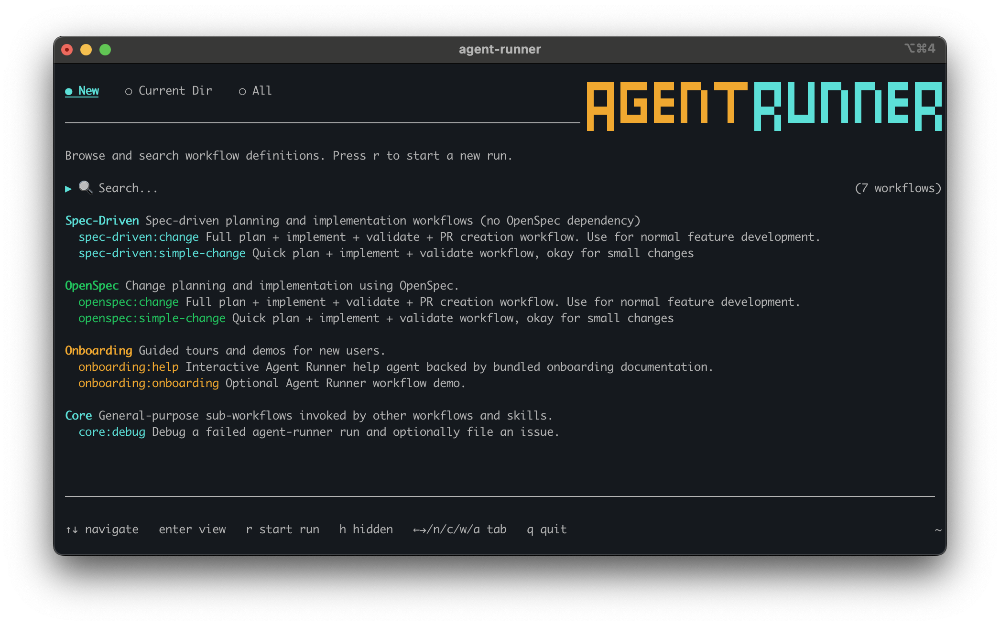

# Quickstart

Install Agent Runner, then run `agent-runner` to open the TUI. First launch opens guided setup and onboarding.

## Prerequisites

| Dependency | Required | Notes |
| --- | --- | --- |
| Supported agent CLI | Yes | Install and authenticate at least one of `claude`, `codex`, `copilot`, `cursor`, or `opencode`. |
| `openspec` | No | Required only for the `openspec:*` built-in workflows. |
| `agent-validator` | Sometimes | Required for built-in validation workflows when Agent Runner was not installed through Homebrew. |

## Install

Homebrew is the preferred install path on macOS and Linux:

```bash
brew tap Codagent-AI/tap
brew install --cask agent-runner
```

The Homebrew cask installs Agent Runner and its helper CLIs, including `agent-plugin` and `agent-validator`.

On Linux without Homebrew, download the latest release tarball for your architecture and install the helper CLIs separately:

```bash
curl -LO https://github.com/Codagent-AI/agent-runner/releases/latest/download/agent-runner_linux_amd64.tar.gz
tar xzf agent-runner_linux_amd64.tar.gz
sudo mv agent-runner /usr/local/bin/
npm install -g agent-validator @codagent-ai/agent-plugin
```

For local development and source builds, see [Development Guide](development.md).

## Launch

Run Agent Runner with no arguments:

```bash
agent-runner
```

With no arguments, Agent Runner opens the TUI. From there you can browse workflow definitions, start a run, inspect previous runs, or resume an interrupted run.



The TUI opens on the workflow browser, where you can filter workflows, view current-directory or all runs, and start a selected workflow.

## Common Commands

| Command | Purpose |
| --- | --- |
| `agent-runner -list` | Launch the run list TUI. |
| `agent-runner -inspect <run-id>` | Launch the run view TUI for a specific run. |
| `agent-runner -resume` | Open the TUI for resumable runs. |
| `agent-runner -resume <run-id>` | Resume a specific interrupted run. |
| `agent-runner -validate openspec:plan-change change_name=my-change` | Validate a workflow without executing it. |
| `agent-runner openspec:plan-change my-change` | Run a built-in workflow with a positional parameter. |
| `agent-runner -C /path/to/project spec-driven:change` | Change directories before resolving and running a workflow. |
| `agent-runner -version` | Print the version and exit. |

`-validate` accepts workflow parameters only as `key=value`. Normal runs accept positional parameters, `key=value` parameters, or a mix of both.

## TUI Shortcuts

| Shortcut | Location | Action |
| --- | --- | --- |
| `?` | Workflow browser | Start the built-in help agent. |
| `s` | Workflow browser | Open the user settings editor where available. |
| `d` | Inactive run detail view | Launch the debug workflow for that run. |
