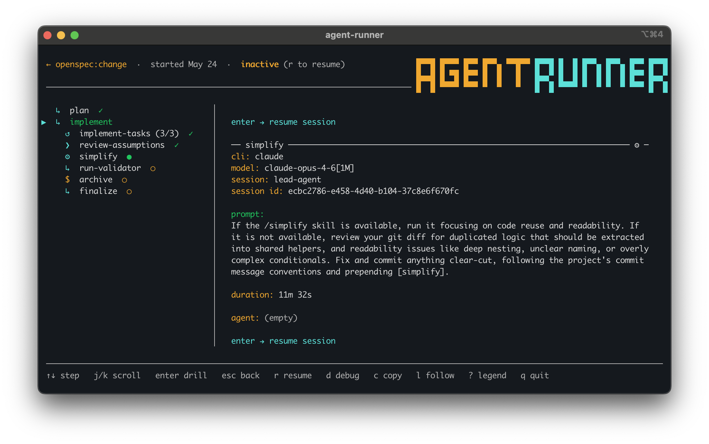

# Run State And Audit

Agent Runner persists run state outside the agent session. Stored state lets runs be inspected, resumed, debugged, and audited after the agent CLI exits.

## Storage Layout

Runs are stored under:

```text
~/.agent-runner/projects/<encoded-cwd>/runs/<run-id>/
```

Important files:

| File | Purpose |
| --- | --- |
| `state.json` | Resume state, current step, session IDs, params, captures, nested progress, and completion flag. |
| `audit.log` | JSONL event log for the run. |
| `run-metrics.json` | Versioned per-attempt metrics, execution sessions, and run totals. |
| `output/` | Per-step output files used by the live run view and workflows. |
| `bundled/` | Materialized bundled scripts and assets for built-in workflow runs. |

## Audit Events

Audit events include:

| Event | Meaning |
| --- | --- |
| `run_start` | A workflow run started. |
| `run_end` | A workflow run ended. |
| `step_start` | A step started. |
| `step_end` | A step ended. |
| `iteration_start` | A loop iteration started. |
| `iteration_end` | A loop iteration ended. |
| `sub_workflow_start` | A sub-workflow started. |
| `sub_workflow_end` | A sub-workflow ended. |
| `error` | An error was recorded. |

## Run Metrics

`run-metrics.json` is the supported machine-readable metrics artifact for a run. Schema version 1 records:

- each completed step attempt with its identity, nesting prefix, outcome, duration, usage state, and reported API cost;
- loop iteration completions with identity and duration only, avoiding duplicate usage rollups;
- execution sessions with observed active duration and clean/open status; and
- run totals for active duration, token categories, usage coverage, estimated API cost, and cost coverage.

The artifact is rewritten atomically after every terminal step or iteration event and finalized at `run_end`. An interrupted run therefore retains every completion already observed without exposing a partially written JSON document.

On resume, Agent Runner reads this artifact directly, retains earlier attempts, restores cumulative-usage baselines, and appends a new execution session. Paused time between invocations is excluded from active duration. If the existing artifact is corrupt or uses an unsupported schema version, Agent Runner preserves it under a unique `run-metrics.json.bak-<timestamp>` name, starts a fresh artifact with `history_complete: false`, and prints a warning.

## Run Detail View

The run detail view uses the workflow step tree to show progress, completed steps, pending steps, and the currently selected step. If an agent session can be resumed, the detail pane shows the CLI, model, session name, session ID, prompt, and duration.



## Debug Inspection

Read-only debug inspection commands are available for state, audit summaries, and embedded workflow YAML:

```bash
run_id="replace-with-run-id"
session_dir="/path/to/session-dir"
workflow_ref="openspec:plan-change"

agent-runner debug --state "$run_id"
agent-runner debug --audit-summary "$run_id"
agent-runner debug --state-dir "$session_dir"
agent-runner debug --audit-summary-dir "$session_dir"
agent-runner debug --show-workflow "$workflow_ref"
```

See [CLI Reference](cli-reference.md) for the full debug command reference.
