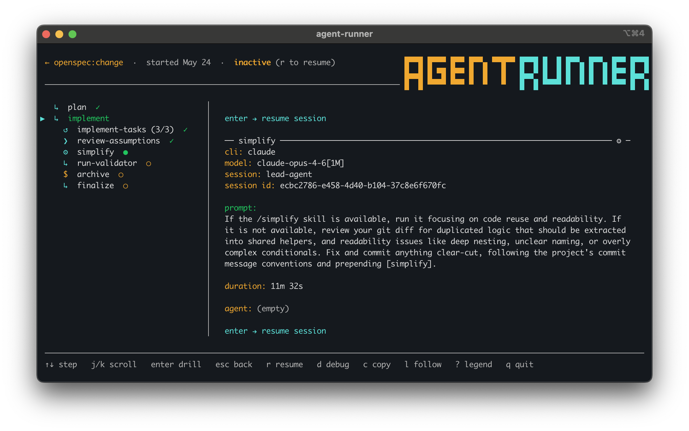

# Run State And Audit

Agent Runner persists run state outside the agent session. Stored state lets runs be inspected, resumed, debugged, and audited after the agent CLI exits.

## Storage Layout

Runs are stored under:

```text
~/.agent-runner/projects/<encoded-cwd>/runs/<run-id>/
```

Important files:

| File | Purpose |
| --- | --- |
| `state.json` | Resume state, exact workflow file, workflow hash, current step, session IDs, params, captures, nested progress, and completion flag. |
| `audit.log` | JSONL event log for the run. |
| `run-metrics.json` | Versioned per-execution metrics, execution sessions, and run totals. |
| `output/` | Per-step and per-agent-call output files used by the live run view and workflows. |
| `bundled/` | Materialized bundled scripts and assets for built-in workflow runs. |

## Audit Events

Audit events include:

| Event | Meaning |
| --- | --- |
| `run_start` | A workflow run started. |
| `run_end` | A workflow run ended. |
| `step_start` | A step started. |
| `step_end` | A step ended. |
| `iteration_start` | A loop iteration started. |
| `iteration_end` | A loop iteration ended. |
| `sub_workflow_start` | A sub-workflow started. |
| `sub_workflow_end` | A sub-workflow ended. |
| `agent_call_start` | An authenticated, validated agent call was accepted. |
| `agent_call_end` | An accepted agent call succeeded, failed, or was canceled. |
| `error` | An error was recorded. |

For explicit multi-repository runs, each repository that starts has a
`repository_start` and terminal `repository_end` boundary. The boundary carries
the configured name, canonical root, selected position, and terminal outcome.
Every event produced while that repository is active adds `repository_name` and
`repository_dir`; workspace work and the transparent implicit `default`
repository retain the legacy event shape. Repository events use a `repo:<name>`
prefix segment, so saved and live run views reconstruct a name-only repository
container while keeping workspace steps outside it. State retains the selected
order, including repositories that remain pending because an earlier target
failed.

`run_start` records the exact versioned workflow path selected for the run, its
version-free YAML name, the content hash, and all params. A sub-workflow
`step_start` records the exact resolved child path and interpolated params;
`sub_workflow_start` and `sub_workflow_end` preserve the nested lifecycle.

## Recorded Workflow Versions

`state.json` keeps the selected physical path in `workflowFile`. That filename
is the run's version authority; there is no separate version field. Resume
reloads that exact file and never substitutes a newer logical sibling. If the
file's contents changed in place, the saved `workflowHash` produces a warning
and resume continues with the current contents. If the recorded version is
missing, resume fails instead of selecting another version.

Legacy unfinished state that records an unversioned on-disk filename must be
migrated to a versioned filename. A legacy `builtin:` run cannot be migrated by
renaming an embedded file: restart it with the current binary or finish it with
the older binary that created it.

Completed runs are read-only inspection, not resume execution. They remain
inspectable when the recorded definition is missing or unversioned as long as
saved state and audit evidence can reconstruct the view. Saved-run breadcrumbs
show the recorded `v<major>.<minor>` label, or `unversioned` for legacy state;
live runs and definition previews remain version-neutral.

## Run Metrics

`run-metrics.json` is the supported machine-readable metrics artifact for a run. Schema version 1 records:

- each completed step attempt with its identity, nesting prefix, outcome, duration, usage state, and reported API cost;
- each terminal accepted agent call as a `kind: "agent-call"` record with call, parent-attempt, target, session, usage, and cost fields;
- loop iteration completions with identity and duration only, avoiding duplicate usage rollups;
- execution sessions with observed active duration and clean/open status; and
- run totals for active duration, token categories, usage coverage, estimated API cost, and cost coverage.

The artifact is rewritten atomically after every terminal step or iteration event and finalized at `run_end`. An interrupted run therefore retains every completion already observed without exposing a partially written JSON document.

Records produced in an explicit repository also include `repository_name` and
`repository_dir`. Consumers can group repository work directly from those
fields rather than decoding nesting prefixes. Workspace and implicit-repository
records omit both fields.

On resume, Agent Runner reads this artifact directly, retains earlier attempts, restores cumulative-usage baselines, and appends a new execution session. Paused time between invocations is excluded from active duration. If the existing artifact is corrupt or uses an unsupported schema version, Agent Runner preserves it under a unique `run-metrics.json.bak-<timestamp>` name, starts a fresh artifact with `history_complete: false`, and prints a warning.

## Run Detail View

The run detail view uses the workflow step tree to show progress, completed steps, pending steps, and the currently selected step. If an agent session can be resumed, the detail pane shows the CLI, model, session name, session ID, prompt, and duration.

Accepted agent calls appear as dynamic child executions beneath their exact parent. Their stdout and stderr are loaded from call-specific files in `output/`; audit metadata is not treated as the child's full response. A completed parent with calls drills into a `parent turn` row and chronological call rows. See [Agent Calls](agent-calls.md) for the rendering and resume contract.

Explicit repositories are a further drillable container level. Their details,
output, metrics, evidence, and pull-request links are scoped to that repository;
the run breadcrumb lists the workspace pull request first and repository links
in persisted affected-repository order.



## Debug Inspection

Read-only debug inspection commands are available for state, audit summaries, and embedded workflow YAML:

```bash
run_id="replace-with-run-id"
session_dir="/path/to/session-dir"
workflow_ref="openspec:plan-change"

agent-runner debug --state "$run_id"
agent-runner debug --audit-summary "$run_id"
agent-runner debug --state-dir "$session_dir"
agent-runner debug --audit-summary-dir "$session_dir"
agent-runner debug --show-workflow "$workflow_ref"
```

See [CLI Reference](cli-reference.md) for the full debug command reference.
