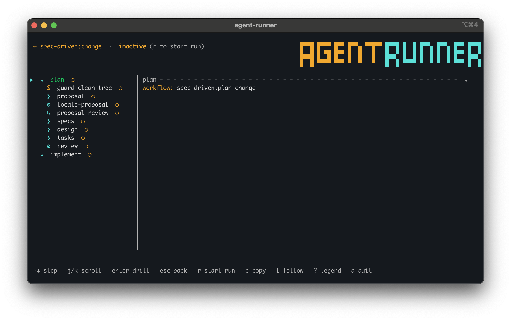

# Writing Workflows

Agent Runner workflows are YAML files that coordinate agent CLIs, shell commands, scripts, UI prompts, loops, and sub-workflows. Workflows can capture output from one step and interpolate it into later steps.

## Workflow Discovery

Workflow names resolve in this order:

| Order | Location |
| --- | --- |
| 1 | `.agent-runner/workflows/<name>.yaml` or `.agent-runner/workflows/<name>.yml` in the current project |
| 2 | `~/.agent-runner/workflows/<name>.yaml` or `~/.agent-runner/workflows/<name>.yml` |
| 3 | Built-ins using `<namespace>:<name>` |

Examples:

```bash
agent-runner deploy
agent-runner team/deploy prod
agent-runner core:run-validator
agent-runner openspec:plan-change my-change
agent-runner spec-driven:simple-change
```

Built-in namespaces currently include `core`, `openspec`, `spec-driven`, and `onboarding`.

Project workflows shadow user workflows with the same name. Built-ins are embedded into the binary from [`workflows/`](../workflows/).

In the TUI, open a workflow to inspect its step tree before starting a run. Nested workflow and loop steps are shown in the left pane, while the right pane shows the selected step's details.



## Basic Workflow

```yaml
name: hello
description: "A simple two-step workflow"

steps:
  - id: greet
    agent: planner
    prompt: "Say hello and list the files in the current directory."

  - id: summarize
    session: resume
    prompt: "Summarize what you found."
```

The first agent step defaults to `session: new`, so it must specify an `agent` profile. Later agent steps default to `session: resume` and continue the most recent session unless you set a different session.

Run it:

```bash
agent-runner hello
```

## Parameters

Workflow parameters are declared in `params:` and referenced as `{{name}}`.

```yaml
name: review-pr

params:
  - name: pr_number
    required: true

steps:
  - id: fetch
    command: gh pr checkout {{pr_number}}

  - id: review
    agent: planner
    prompt: "Review PR {{pr_number}}."
```

Run with positional or keyed arguments:

```bash
agent-runner review-pr 42
agent-runner review-pr pr_number=42
```

`required` defaults to `true`. Sub-workflows can also use `default` values for omitted parameters.

## Built-In Variables

Every step can reference:

| Variable | Value |
| --- | --- |
| `{{session_dir}}` | Absolute path to the current run directory, such as `~/.agent-runner/projects/<encoded-cwd>/runs/<run-id>`. |
| `{{step_id}}` | Current step ID. |

Workflow parameters and captured variables shadow built-ins with the same name.

## Agent Steps

```yaml
- id: plan
  agent: planner
  prompt: "Plan the change."

- id: implement
  agent: implementor
  session: new
  mode: autonomous
  prompt: "Implement the plan."

- id: review
  session: resume
  mode: autonomous
  prompt: "Review what you just changed."
```

Supported CLI adapters are `claude`, `codex`, `copilot`, `cursor`, and `opencode`.

Interactive agent steps hand the real terminal directly to the agent CLI. Agent Runner injects an absolute-path completion command into the step prompt; after answering the user, the agent runs that command to send an authenticated event through the run's private control channel. Users can ask the agent to continue or invoke the CLI-native completion command (`/agent-runner:next` in Claude, Copilot, and Cursor; `$agent-runner-next` in Codex). If the CLI exits before completion is accepted, the step is treated as aborted so you can resume the workflow later.

Autonomous steps run without user interaction. Depending on `~/.agent-runner/settings.yaml`, autonomous steps may run in headless mode or in an interactive backend with autonomy instructions. Capturing an autonomous agent step forces headless execution so `stdout` can be captured reliably.

See [Sessions And Modes](sessions-and-modes.md) for the full session and mode model.

## Shell Steps

```yaml
- id: validate
  command: agent-validator run --report
  capture: validator_output
  capture_stderr: true
  continue_on_failure: true
```

Shell commands are interpolated with shell-safe quoting and run through `sh -c`, resolved from `PATH`. Non-zero exit codes fail the step unless `continue_on_failure: true` is set.

Shell steps may set `mode: interactive` to inherit the user's real terminal. Their output is live-only, and interactive shell steps cannot use `capture`.

## Script Steps

Script steps run static workflow-local or bundled scripts.

```yaml
- id: detect
  script: detect-options.sh
  script_inputs:
    cwd: "{{session_dir}}"
  capture: options
  capture_format: json
```

`script` must be a static relative path and cannot use interpolation or path traversal. `script_inputs` are passed to the script as JSON on `stdin`. `capture_format` may be `text` or `json`; JSON captures must be either an array of strings or an object whose values are strings.

## UI Steps

UI steps render inside the live run TUI.

```yaml
- id: choose-cli
  mode: ui
  title: "Choose CLI"
  body: "Select the CLI for this run."
  inputs:
    - kind: single_select
      id: cli
      prompt: "CLI"
      options: ["claude", "codex"]
      default: "claude"
  actions:
    - label: "Continue"
      outcome: continue
  capture: setup_inputs
  outcome_capture: setup_action
```

`capture` stores UI inputs as a map. `outcome_capture` stores the selected action outcome as a string. UI steps require a TTY.

## Loops

Counted loop:

```yaml
- id: retry
  loop:
    max: 3
    as_index: attempt
  steps:
    - id: validate
      command: agent-validator run
      continue_on_failure: true
      break_if: success

    - id: fix
      session: inherit
      mode: autonomous
      prompt: "Fix validator failures."
      skip_if: previous_success
```

For-each loop:

```yaml
- id: per-task
  loop:
    over: "tasks/*.md"
    as: task_file
    as_index: i
    require_matches: true
  steps:
    - id: implement
      agent: implementor
      session: new
      mode: autonomous
      prompt: "Implement {{task_file}}."
```

`break_if: success` or `break_if: failure` exits the enclosing loop. A loop with a break condition fails if all iterations are exhausted without a break. A loop without any break condition succeeds after all iterations complete.

## Sub-Workflows

```yaml
- id: implement-task
  workflow: ../core/implement-task.yaml
  params:
    task_file: "{{task_file}}"
```

Sub-workflow paths resolve relative to the parent workflow. Built-in workflows can call scripts and child workflows bundled in the same namespace. Sub-workflows get their own execution context, receive only explicitly passed parameters plus defaults, and may use `session: inherit` to continue the parent session.

## Flow Control

`continue_on_failure: true` lets the workflow continue after a failed step.

`skip_if` supports:

```yaml
skip_if: previous_success
skip_if: 'sh: test "{{run_session_report}}" != "true"'
```

`previous_success` is not allowed on the first step in a scope. The `sh:` form is allowed on the first step and skips when the shell command exits `0`.

`break_if` supports:

```yaml
break_if: success
break_if: failure
```

It is only valid inside a loop body.

## Capture And Interpolation

Captured values are available to later steps with `{{name}}`.

```yaml
- id: collect
  command: git status --short
  capture: status

- id: summarize
  agent: summarizer
  mode: autonomous
  prompt: |
    Summarize this status:
    {{status}}
```

Shell and autonomous agent captures are strings. Script JSON captures can produce lists or maps. UI captures produce maps. Whole-value interpolation preserves typed values where supported, such as using a captured list as UI select options.

## Validate, Fix, Retry

This workflow runs Agent Validator, captures its report, asks the agent to fix failures, and retries up to three times.

```yaml
name: validate-and-fix
description: "Run validation, ask the agent to fix failures, retry up to 3 times"

sessions:
  - name: fixer
    agent: implementor

steps:
  - id: validator-retry
    loop:
      max: 3
    steps:
      - id: run-validator
        command: agent-validator run --report
        capture: validator_output
        capture_stderr: true
        continue_on_failure: true
        break_if: success

      - id: fix-violations
        session: fixer
        mode: autonomous
        prompt: |
          The validator found failures. Fix the issues you reasonably agree with.

          <validator-output>
          {{validator_output}}
          </validator-output>
        skip_if: previous_success
        continue_on_failure: true
```

Agent Runner enforces the loop. The named `fixer` session gives the first fix step a real agent profile and lets later loop iterations resume the same role. The agent only sees the focused task for the current step.
